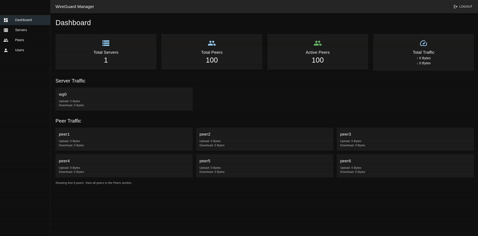

# WireGuard Manager

A modern web-based management system for WireGuard VPN servers, built with Go backend and React frontend, using Docker containers for WireGuard instances.

# Demo 


## Architecture

This system uses a containerized approach where:
- **Backend**: Go API that manages WireGuard Docker containers
- **Frontend**: React web interface for user management
- **WireGuard**: Each server runs in its own Docker container using `linuxserver/wireguard`
- **Database**: PostgreSQL for storing server and peer configurations

## Features

- **Containerized WireGuard**: Each server runs in its own Docker container
- **User Management**: Multi-user system with role-based access
- **QR Code Generation**: Easy mobile client configuration
- **Dashboard**: Real-time statistics and traffic monitoring
- **Auto-restart**: Containers automatically restart when peers are added/removed
- **Web Interface**: Modern React-based UI

## Prerequisites

- Docker and Docker Compose
- Linux host with kernel modules support
- Public IP address for the server

## Quick Start

1. **Clone the repository**:
   ```bash
   git clone <repository-url>
   cd wireguard-manager
   ```

2. **Create environment file**:
   ```bash
   cp .env.example .env
   ```

3. **Configure environment variables** in `.env`:
   ```bash
   # Database
   DB_PASSWORD=your_secure_password
   
   # JWT Secret (generate a random string)
   JWT_SECRET=your_jwt_secret_here
   
   # Admin password
   DEFAULT_ADMIN_PASSWORD=admin123
   
   # Your server's public IP
   WG_PUBLIC_IP=your.public.ip.address
   
   # Frontend API URL
   REACT_APP_API_URL=http://localhost:8080
   ```

4. **Start the system**:
   ```bash
   docker-compose up -d
   ```

5. **Access the web interface**:
   - Frontend: http://localhost:3000
   - Backend API: http://localhost:8080
   - Default login: `admin` / `admin123` (or your configured password)

## Environment Variables

### Backend (.env)
- `DB_PASSWORD`: PostgreSQL database password
- `JWT_SECRET`: Secret key for JWT token generation
- `DEFAULT_ADMIN_PASSWORD`: Initial admin user password
- `WG_PUBLIC_IP`: Your server's public IP address
- `HOST_WG_CONFIGS_PATH`: Host path for WireGuard configs (auto-set)

### Frontend (Docker build arg)
- `REACT_APP_API_URL`: Backend API URL

## Usage

### Creating a WireGuard Server

1. Log in to the web interface
2. Go to "Servers" page
3. Click "Add Server"
4. Fill in the details:
   - **Name**: Unique server name
   - **Listen Port**: UDP port (default: 51820)
   - **Address**: Server IP in CIDR notation (e.g., 10.0.0.1/24)
   - **DNS**: DNS server for clients (e.g., 8.8.8.8)
   - **MTU**: Maximum Transmission Unit (default: 1420)
   - **Initial Peers**: Number of peers to create automatically

5. Click "Create Server"

The system will:
- Generate WireGuard keys automatically
- Create a Docker container with the `linuxserver/wireguard` image
- Set up the initial peers if specified
- Start the container

### Managing Peers

1. Go to "Peers" page
2. Click "Add Peer"
3. Select the server and provide a name
4. The system will:
   - Generate peer keys automatically
   - Assign an IP address from the server's subnet
   - Update the WireGuard container configuration

### Downloading Configurations

- **QR Code**: Click the QR code icon to display a QR code for mobile apps
- **Config File**: Click the download icon to download the `.conf` file

## Container Management

The system automatically manages WireGuard containers:

- **Start/Stop**: Use the action buttons in the Servers page
- **Auto-restart**: Containers restart automatically when peers are added/removed
- **Configuration**: All configs are stored in mounted volumes

## Security Considerations

1. **Change default passwords**: Update the admin password after first login
2. **Firewall**: Ensure only necessary ports are open (3000, 8080, 5432, and your WireGuard ports)
3. **HTTPS**: Use a reverse proxy with SSL for production
4. **Network isolation**: Consider running in a private network

## Troubleshooting

### Container Issues
```bash
# Check container status
docker ps -a

# View container logs
docker logs <container-name>

# Restart a container
docker restart <container-name>
```

### Network Issues
```bash
# Check if ports are open
netstat -tulpn | grep :51820

# Check iptables rules
sudo iptables -L -n -v
```